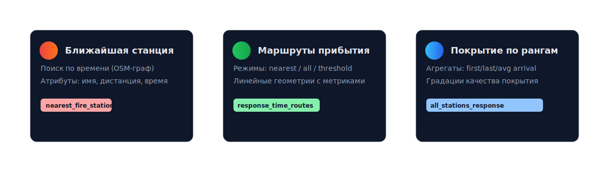

[](README.ru.md)
## Fire Response Time Analysis (QGIS Plugin)

<p align="center">
  
</p>

<p align="center">
  <a href="https://github.com/Moroz-Froze/arrivel-time-calculator" target="_blank">
    
  </a>
  &nbsp;
  <a href="#usage">
    
  </a>
  &nbsp;
  <a href="https://github.com/Moroz-Froze/arrivel-time-calculator/issues" target="_blank">
    
  </a>
</p>

A QGIS 3.x plugin for fire response time analysis: identifying the nearest fire station by travel time, generating OSM-based routes, and evaluating coverage based on fire incident ranks.

<p align="center">
  
</p>

### Features
- **Nearest Fire Station (`nearest_fire_station`)**:
  - Identifies the nearest fire station based on the shortest travel time over the OSM road network.
  - Output attributes: `nearest_station`, `distance_km`, `response_time_min`, `station_x`, `station_y` + original object attributes.
- **Response Time Routes (`response_time_routes`)**:
  - Generates linear routes on the OSM road graph between incident locations and fire stations.
  - Modes: to the nearest station only; to all stations; to all stations within a specified time threshold.
  - Output attributes: `object_id`, `station_name`, `distance_km`, `response_time_min`, `object_type`, `route_type`.
- **All Stations Response by Fire Rank (`all_stations_response`)**:
  - Evaluates response times from multiple fire stations based on fire rank (1–5) and a configurable station limit.
  - Calculates `first_arrival_min`, `last_arrival_min`, `avg_arrival_min`, generates a `station_list`, and provides a `response_coverage` assessment.

### How It Works
- Internally uses the `graph_utils.py` module to:
  - Build an OSM road graph based on the extent of your input layers (with a small buffer),
  - Assign travel speeds by road type and compute travel time on graph edges,
  - Convert speeds from km/h to m/min.
- Algorithms automatically detect the station name field in the fire stations layer.
- Supports project coordinate reference systems (CRS): route geometries are automatically converted to/from WGS84.

<details>
<summary>Speed Profile and OSM Graph</summary>

- `graph_utils.py` constructs the road graph from the input layer extents with a buffer.
- The `set_graph_travel_times` function assigns speeds and populates the `travel_time` attribute on edges.
- Default speeds are defined for groups of OSM `highway` tags (see table below).

</details>

<p align="center">
  
  <br/>
  <sub>Input layers → OSM graph → algorithms → output layers</sub>
</p>

### Requirements
- QGIS: 3.16 – 3.99
- Internet access (required to fetch OSM road graph via OSMnx)
- Python dependencies in the QGIS environment: `osmnx`, `networkx` (usually `shapely` is already included with QGIS)

### Installing Dependencies (Windows, OSGeo4W/QGIS)
1. Open the **OSGeo4W Shell** (or **QGIS Python Console**).  
2. Install the packages (specify versions compatible with your QGIS/Python build if needed):

```bash
python -m pip install --upgrade pip
python -m pip install "osmnx>=1.4,<2.0" "networkx>=2.6,<3.0"
# If compatibility issues arise, try pinning versions:
# python -m pip install osmnx==1.6.0 networkx==2.8.8
```

If you're behind a proxy or on a corporate network, add `--proxy` flags or configure environment variables beforehand.

### Plugin Installation
- Copy the plugin folder `fire_analysis_plugin` into your QGIS profile plugins directory.  
  Example (Windows):  
  - `C:\Users\<USER>\AppData\Roaming\QGIS\QGIS3\profiles\default\python\plugins\fire_analysis_plugin`
- Restart QGIS and enable the plugin via **Plugins → Manage and Install Plugins**.

### Usage
1. Load into your project:
   - An **incident layer** (points or polygons)
   - A **fire stations layer** (points)
2. Open the **Processing Toolbox** → group **Fire Response Analysis**.
3. Run the desired algorithm and configure parameters:
   - **Incident layer**, **Fire stations layer** — input data.
   - **Average speeds / Speed profile** — optional; defaults are used if not provided.
   - For routes: choose a mode and, if applicable, set a time threshold.
4. Save the output layer:
   - Point/polygon layer for nearest station,
   - Line layer for routes,
   - Same geometry type as input for all-stations-by-rank analysis.

<p align="center">
  
</p>

#### Route Generation Modes
<p>
  
</p>

### Default Speed Profile (km/h)
- **1**: Urban arterial/primary roads — 49 km/h  
- **2**: Secondary/district roads — 37 km/h  
- **3**: Local/residential streets — 26 km/h  
- **4**: Service/access roads — 16 km/h  
- **5**: Pedestrian paths / drivable non-roads — 5 km/h  

These values are used to assign speeds to OSM graph edges based on the `highway` tag.

| Group | OSM `highway` tags                                      | Speed (km/h) |
|-------|----------------------------------------------------------|--------------|
| 1     | trunk, motorway(+_link), primary(+_link)                | 49           |
| 2     | secondary(+_link), unclassified                         | 37           |
| 3     | tertiary(+_link), residential, living_street            | 26           |
| 4     | road, service, track                                    | 16           |
| 5     | footway, path, pedestrian, steps, cycleway, bridleway, corridor | 5    |

### Tips and Limitations
- **OSM Completeness**: Route accuracy depends on the completeness and recency of OpenStreetMap data in your area of interest.
- **Graph Loading**: For large extents, increase the buffer cautiously—it affects graph size and computation time.
- **CRS**: Algorithms handle coordinate transformations correctly, but input layers must have valid CRS definitions.
- **OSMnx**: If the graph fails to load, a clear error message will appear; ensure required packages are installed in the QGIS Python environment.

### Example Outputs
- **Nearest Station**: Point/polygon layer with time/distance attributes and station name.
- **Routes**: Line layer with routes and time/distance attributes for each object–station pair.
- **All Stations by Rank**: Layer with aggregated metrics (`first/last/avg_arrival_min`) and a list of responding stations.

<p>
  
</p>

#### Coverage Assessment
<p>
  
</p>

### Feedback and Source Code
- Repository: [GitHub](https://github.com/Moroz-Froze/arrivel-time-calculator)  
- Bug reports / feature requests: [Issues](https://github.com/Moroz-Froze/arrivel-time-calculator/issues)

### Changelog
- **v1.1.0 — Fire Response 1.0**: Added OSM routing and coverage analysis; 3 algorithms, OSM graph module, automatic station name field detection, enhanced output attributes.

### License
See the `LICENSE` file (if present) or the license information in the plugin metadata.
