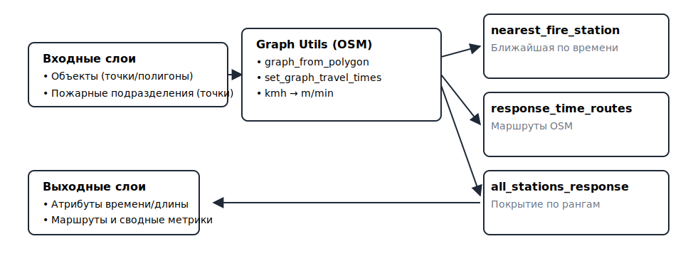
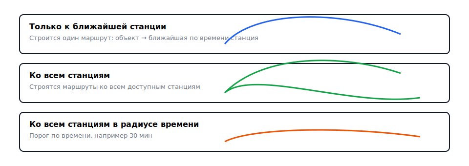

[](README.md)
## Fire Response Time Analysis (QGIS Plugin)

<p align="center">
  
</p>

<p align="center">
  <a href="https://github.com/Moroz-Froze/arrivel-time-calculator" target="_blank">
    
  </a>
  &nbsp;
  <a href="#использование">
    
  </a>
  &nbsp;
  <a href="https://github.com/Moroz-Froze/arrivel-time-calculator/issues" target="_blank">
    
  </a>
</p>

Плагин для QGIS 3.x для анализа времени прибытия пожарных подразделений: определение ближайшей части по времени, построение маршрутов по графу OSM и оценка покрытия по рангам пожара.

<p align="center">
  
</p>

### Возможности
- **Ближайшее подразделение (nearest_fire_station)**: 
  - Определяет ближайшую пожарную часть по кратчайшему времени следования по дорожному графу OSM.
  - Выходные атрибуты: `nearest_station`, `distance_km`, `response_time_min`, `station_x`, `station_y` + атрибуты исходного объекта.
- **Маршруты времени прибытия (response_time_routes)**:
  - Генерация линейных маршрутов на дорожном графе OSM между объектами и подразделениями.
  - Режимы: только к ближайшей; ко всем; ко всем в пределах порога времени.
  - Выходные атрибуты: `object_id`, `station_name`, `distance_km`, `response_time_min`, `object_type`, `route_type`.
- **Анализ всех подразделений по рангам (all_stations_response)**:
  - Оценка времени прибытия нескольких подразделений в зависимости от ранга пожара (1–5) и лимита их количества.
  - Считает `first_arrival_min`, `last_arrival_min`, `avg_arrival_min`, формирует `station_list` и оценку `response_coverage`.

### Как это работает
- Внутри используется модуль `graph_utils.py` для:
  - построения дорожного графа OSM по экстенту ваших слоёв (с небольшим буфером),
  - назначения скоростей движения по типам дорог и расчёта времени следования на рёбрах,
  - конвертации скоростей из км/ч в м/мин.
- Алгоритмы автоматически определяют текстовое поле названия подразделения в слое станций.
- Поддерживается работа в системе координат проекта: геометрии маршрутов преобразуются из/в WGS84 автоматически.

<details>
<summary>Скоростной профиль и граф OSM</summary>

- `graph_utils.py` строит дорожный граф по экстенту входных слоёв с буфером.
- Функция `set_graph_travel_times` проставляет скорости и поле `travel_time` на рёбрах.
- Скорости по умолчанию заданы для групп `highway`‑тегов (см. таблицу ниже).

</details>

<p align="center">
  
  <br/>
  <sub>Входные слои → OSM‑граф → алгоритмы → выходные слои</sub>
</p>

### Требования
- QGIS: 3.16 – 3.99
- Интернет-доступ (для получения графа дорог OSM через OSMnx)
- Зависимости Python в среде QGIS: `osmnx`, `networkx` (обычно `shapely` уже присутствует с QGIS)

### Установка зависимостей (Windows, OSGeo4W/QGIS)
1) Откройте «OSGeo4W Shell» (или «QGIS Python Console»).  
2) Установите пакеты (при необходимости укажите версии, совместимые с вашей сборкой QGIS/Python):

```bash
python -m pip install --upgrade pip
python -m pip install "osmnx>=1.4,<2.0" "networkx>=2.6,<3.0"
# При проблемах совместимости попробуйте закрепить версии:
# python -m pip install osmnx==1.6.0 networkx==2.8.8
```

Если используете прокси/корпоративную сеть, добавьте ключи `--proxy` или предварительно настройте переменные окружения.

### Установка плагина
- Скопируйте папку плагина `fire_analysis_plugin` в каталог профиля QGIS плагинов.  
  Пример (Windows): 
  - `C:\Users\<USER>\AppData\Roaming\QGIS\QGIS3\profiles\default\python\plugins\fire_analysis_plugin`
- Перезапустите QGIS и активируйте плагин в «Управлении и установке модулей».

### Использование
1) Загрузите в проект слой объектов (точки/полигоны) и слой пожарных подразделений (точки).
2) Откройте «Processing Toolbox» → группа `Fire Response Analysis`.
3) Запустите нужный алгоритм и задайте параметры:
   - `Слой объектов`, `Слой пожарных подразделений` — входные данные.
   - `Средние скорости/Профиль скоростей` — опционально, иначе используются значения по умолчанию.
   - Для маршрутов: выберите режим и при необходимости порог времени.
4) Сохраните выходной слой (точечный/полигональный для ближайшей станции; линейный для маршрутов; тип геометрии как у объектов — для анализа всех подразделений).

<p align="center">
  
</p>

#### Режимы построения маршрутов
<p>
  
</p>

### Профиль скоростей по умолчанию (км/ч)
- **1**: Магистральные городские/общегородского значения — 49
- **2**: Магистральные районного значения — 37
- **3**: Местного значения/жилые — 26
- **4**: Служебные проезды — 16
- **5**: Пешеходные/территории, пригодные для проезда — 5

Эти значения используются для назначения скорости на рёбрах графа OSM в зависимости от `highway`-тега.

| Группа | OSM highway                  | Скорость (км/ч) |
|--------|------------------------------|-----------------|
| 1      | trunk, motorway(+_link), primary(+_link) | 49 |
| 2      | secondary(+_link), unclassified          | 37 |
| 3      | tertiary(+_link), residential, living_street | 26 |
| 4      | road, service, track                    | 16 |
| 5      | footway, path, pedestrian, steps, cycleway, bridleway, corridor | 5 |

### Советы и ограничения
- **Полнота OSM**: точность маршрутов зависит от актуальности/полноты данных OpenStreetMap в интересующей области.
- **Загрузка графа**: при больших экстентах увеличивайте буфер с осторожностью — это влияет на объём графа и время расчётов.
- **CRS**: алгоритмы корректно преобразуют координаты, однако исходные слои должны иметь валидные СК.
- **OSMnx**: при отсутствии/ошибке загрузки будет показано информативное сообщение; убедитесь, что пакеты установлены в среде QGIS.

### Примеры результатов
- Ближайшая станция: точечный/полигональный слой объектов с атрибутами времени/расстояния и названием станции.
- Маршруты: линейный слой с маршрутами и атрибутами времени/длины для связок объект–станция.
- Все подразделения (по рангам): слой объектов с агрегированными метриками (`first/last/avg_arrival_min`) и списком станций.

<p>
  
</p>

#### Оценка покрытия
<p>
  
</p>

### Обратная связь и исходники
- Репозиторий: `[GitHub]` (`https://github.com/Moroz-Froze/arrivel-time-calculator`)
- Отчёты об ошибках/предложения: `[Issues]` (`https://github.com/Moroz-Froze/arrivel-time-calculator/issues`)

### Журнал изменений
- 1.1.0 — Fire Response 1.0: добавлены OSM‑маршруты и анализ покрытия; 3 алгоритма, модуль графа OSM, автоопределение поля названия станции, улучшенные атрибуты выходных слоёв.

### Лицензия
См. файл `LICENSE` (если присутствует) или описание лицензии в метаданных плагина.


